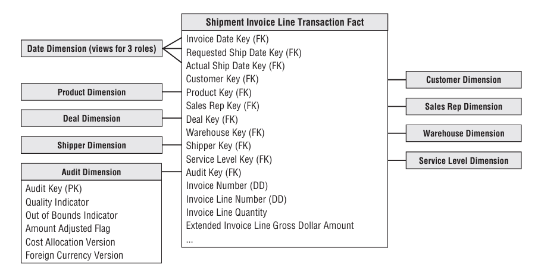
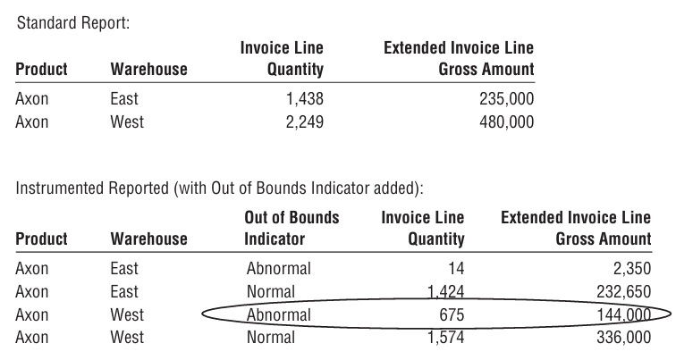

Business thực sự muốn hỏi gì?

❓ Tôi có nên tin số liệu này không?

❓ Có dữ liệu nào bị bất thường (out-of-bounds) không?

❓ Chi phí được tính theo version nào của logic?

❓ Quy đổi ngoại tệ theo rule version nào?

---

Gắn metadata ETL thành một dimension bình thường, ưu tiên cấu trúc đơn giản.

| Cột                      | Ý nghĩa                         |
| ------------------------ | ------------------------------- |
| Quality Indicator        | Dữ liệu có đạt chất lượng không |
| Out of Bounds Indicator  | Có giá trị bất thường không     |
| Amount Adjusted Flag     | Có bị ETL chỉnh số không        |
| Cost Allocation Version  | Version logic phân bổ chi phí   |
| Foreign Currency Version | Version rule quy đổi tiền       |

---

Kết quả ở tầng OLAP cube rất thuận mắt, nhìn dòng nào biết bất thường.

