# Order Management

Order management gồm nhiều **business process** quan trọng, ví dụ:
- Order processing – xử lý đơn hàng
- Shipment processing – giao hàng
- Invoice processing – xuất hóa đơn

Các process này sinh ra những chỉ số cực kỳ quan trọng (**metrics**) như:
- Sales volume – số lượng bán
- Invoice revenue – doanh thu theo hóa đơn

**Chương này đề cập junk, degenerate dim.**

## I. Bus Matrix
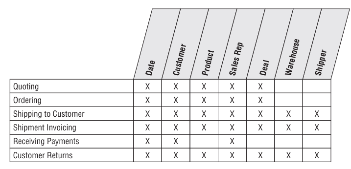

- ***Quoting** – Báo giá*
- ***Ordering** – Đặt hàng*
- ***Shipping to Customer** – Giao hàng*
- ***Shipment Invoicing** – Xuất hóa đơn cho shipment*
- ***Receiving Payments** – Nhận tiền*
- ***Customer Returns** – Hàng trả lại*

## II. Order Transactions
1 dòng fact = 1 dòng hàng trong đơn

dim xung quanh
- order date, requested ship date, product, customer, sales rep(sale representative), and deal.

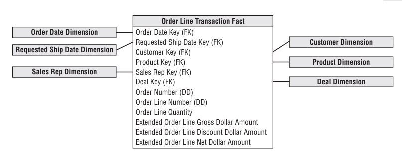

### 1. Fact Normalization
Nhiều người ko thích để full measurement ở 1 dòng fact, họ muốn 
| order_id | line_id | product | customer | measurement_type | amount |
| -------- | ------- | ------- | -------- | ---------------- | ------ |
| 1001     | 1       | A       | C01      | **GROSS**        | 100    |
| 1001     | 1       | A       | C01      | **DISCOUNT**     | 10     |
| 1001     | 1       | A       | C01      | **NET**          | 90     |
| 1001     | 2       | B       | C01      | **GROSS**        | 200    |
| 1001     | 2       | B       | C01      | **DISCOUNT**     | 0      |
| 1001     | 2       | B       | C01      | **NET**          | 200    |


thay vì 

| order_id | line_id | product | customer | gross | discount | net |
| -------- | ------- | ------- | -------- | ----- | -------- | --- |
| 1001     | 1       | A       | C01      | 100   | 10       | 90  |
| 1001     | 2       | B       | C01      | 200   | 0        | 200 |


Cái đầu tiên ngu ngốc sinh ra nhiều record.

---

### 2. DIM role playing
Tạo view table từ dim gốc và alias name các col để phân biệt dim gốc.

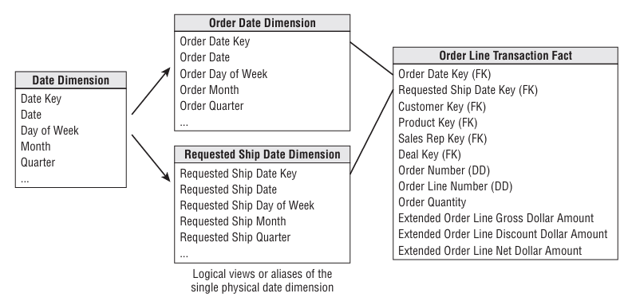

---

```sql
create view order_date
  (order_date_key, order_day_of_week, order_month, ...) 
  as select date_key, day_of_week, month, ... from date

create view req_ship_date
  (req_ship_date_key, req_ship_day_of_week, req_ship_month, ...) 
  as select date_key, day_of_week, month, ... from date

```

### 3. Customer DIM
- Customer DIM phải thể hiện được địa điểm giao hàng cụ thể -> Flatten địa lý chung luôn
- Customer DIM thường rất to
    - có thể bao quanh bởi nhiều cấp địa lý khác nhau
    - mô hình tổ chức khác hàng. Mua 1 chỗ `ship to`. Thanh toán chỗ khác `bill-to` (cty con mua, thanh toán công ty mẹ)

    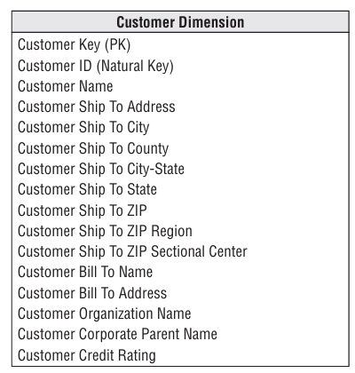

---

- **`Trường hợp ship-to, bill-to ko đẹp thì sao`**
    - **Case 1**: ship tới 1 chỗ, bill tới nhiều chỗ (Do kế toán ở 2 chỗ khác nhau)
        - **Giải pháp**: cho nhìu row trong dim_customer luôn

        | customer_key | ship_to    | bill_to          |
        | ------------ | ---------- | ---------------- |
        | 101          | BD factory | Accounting South |
        | 102          | BD factory | Accounting North |


    - **Case 2**: ship tới nhiều chỗ, bill cũng tới nhiều chỗ
        - **Giải pháp**: Tạo dim_ship_to, dim_bill_to, cắm vô fact

---

**`📌Sales Representative: gộp vào customer hay tách riêng?`**

`1. Khi NÊN gộp`

Gộp sales rep vào customer dimension nếu:

* Quan hệ **1-1 hoặc many-to-1**
* Ít thay đổi theo thời gian
* Rep gắn chặt với customer


`2. Khi PHẢI tách`

Tách sales rep thành dimension riêng nếu **có bất kỳ điều nào sau**:

1. Many-to-many là bình thường
2. Quan hệ thay đổi theo thời gian
3. Customer dimension rất lớn
4. Rep & customer xuất hiện ở fact khác
5. Business coi rep và customer là 2 thực thể khác nhau

👉 Gặp 1–2 điều thôi là **nên tách**.

---

**`Factless Fact Table for Customer/Rep Assignments`**

Đôi khi user BI muốn xem Reps và Customers mặc dù khách chưa có đơn hàng

Ví dụ thực tế:

* Sales rep A được assign chăm sóc Customer X từ **01/01 → 31/03**
* Nhưng **Customer X không đặt đơn nào trong giai đoạn đó**
* Business vẫn muốn:

  * biết việc phân công này **đã tồn tại**
  * đánh giá hiệu quả sales rep (chăm mà không ra đơn)
  * biết Rep A đang phụ trách bao nhiêu customer trong tháng 2?


👉 **Order fact table không lưu được chuyện này**, vì:

* Không có order ⇒ **không có record**

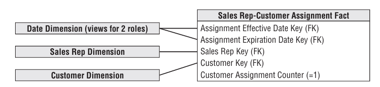

---

### 4. Deal DIM
Deal đi theo allowance, Terms, Incentive.

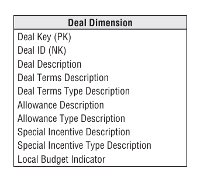
#### ✅ Trường hợp 1: **đi theo combo cố định (correlated)**

> **Flatten terms, allowance, incentive vào 1 `dim_deal`**

* 3 entity:

  * Terms
  * Allowance
  * Incentive
* **luôn xuất hiện cùng nhau theo một gói deal xác định**
* Không có chuyện mix tùy ý

👉 Khi đó:

* 1 row trong `dim_deal` = **1 deal thực sự tồn tại**
* Không sinh Cartesian product
* User BI tư duy theo “deal” chứ không theo từng mảnh

📌 **Đây là case Kimball khuyến nghị flatten**

---

#### ❌ Trường hợp 2: **match tự do / độc lập (uncorrelated)**

> **Tách thành 3 dimension riêng, KHÔNG dùng `dim_deal`**

* Terms có thể kết hợp với nhiều Allowance
* Incentive thay đổi độc lập
* Combo phát sinh linh tinh

👉 Nếu vẫn cố flatten:

* Dimension phình to
* Sinh **Cartesian product**
* Rất nhiều combo **không có nghĩa business**

📌 Khi đó:

* `dim_terms`
* `dim_allowance`
* `dim_incentive`

Fact table chứa:

* 3 FK
* nhưng data sạch, logic rõ

---

### 5. Degenerate Dimension
Bao gồm
- order_number: Xác định đơn
- line_number: Xác định thứ tự trong đơn

`fact_order_line`
| order_number (DD) | line_number (DD) | order_date_key | product_key | customer_key | qty | revenue |
| ----------------- | ---------------- | -------------- | ----------- | ------------ | --- | ------- |
| O1001             | 1                | 20240105       | P10         | C01          | 2   | 200     |
| O1001             | 2                | 20240105       | P25         | C01          | 1   | 150     |
| O1002             | 1                | 20240106       | P10         | C02          | 3   | 300     |
| O1003             | 1                | 20240106       | P40         | C03          | 1   | 500     |
| O1003             | 2                | 20240106       | P25         | C03          | 2   | 300     |
| O1003             | 3                | 20240106       | P99         | C03          | 1   | 100     |

---

### 6. Junk Dimension
Trong giao dịch gặp rất nhiều thuộc tính lặt vặt mà cardinality thấp.
- Payment type: Cash / Visa / MasterCard
- Order type: Inbound / Outbound
- Commissionable: Yes / No
- Gift order: Yes / No
- Urgent flag: Y / N
- ...

---

Để hết ở fact sẽ gây nặng -> Tạo dim chỉ ra các nhóm
    - Thực tế nên tạo các tổ hợp bạn nghĩ sẽ dùng thôi
    - Trong quá trình phát triển nếu có tổ hợp mới insert vào junk dim sau

Ví dụ **Junk Dimension**
`dim_order_indicator`
| order_indicator_key | payment_type | payment_group | order_type | commission_flag    |
| ------------------- | ------------ | ------------- | ---------- | ------------------ |
| 1                   | Cash         | Cash          | Inbound    | Commissionable     |
| 2                   | Cash         | Cash          | Inbound    | Non-Commissionable |
| 3                   | Cash         | Cash          | Outbound   | Commissionable     |
| 4                   | Cash         | Cash          | Outbound   | Non-Commissionable |
| 5                   | Visa         | Credit        | Inbound    | Commissionable     |
| 6                   | Visa         | Credit        | Inbound    | Non-Commissionable |
| 7                   | Visa         | Credit        | Outbound   | Commissionable     |
| 8                   | Visa         | Credit        | Outbound   | Non-Commissionable |
| 9                   | MasterCard   | Credit        | Inbound    | Commissionable     |
| 10                  | MasterCard   | Credit        | Inbound    | Non-Commissionable |
| 11                  | MasterCard   | Credit        | Outbound   | Commissionable     |
| 12                  | MasterCard   | Credit        | Outbound   | Non-Commissionable |


**Fact table trông thế nào?**
| order_number (DD) | line_number (DD) | order_indicator_key | product_key | qty | revenue |
| ----------------- | ---------------- | ------------------- | ----------- | --- | ------- |
| O1001             | 1                | 1                   | P10         | 2   | 200     |
| O1001             | 2                | 5                   | P25         | 1   | 150     |
| O1002             | 1                | 9                   | P40         | 1   | 500     |


**User BI rất thích**
- Thay vì where nhiều thuộc tính họ có thể 
```sql
WHERE order_indicator_key IN (1,2,5,6,9,10)
```

### 7. Multiple currency
Currency được yêu cầu:
- Local
- Global/Chuẩn của business

Quy tắc DE phải giải quyết mọi thứ trong DW, ko để User BI tính.

Tính luôn metrics song song.

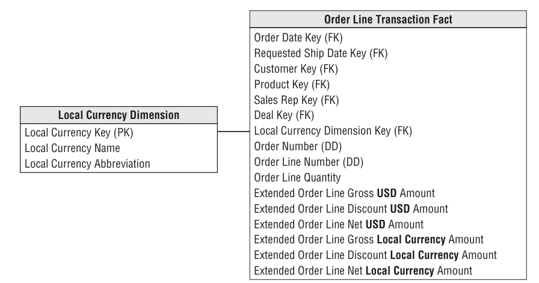

---

Nếu ko thích nhiều cột 1 fact, có thể cột conversion nhưng làm view tính (nhân local cho conversion) giùm BI user nhé.

**Fact table**
| qty | gross_local | discount_local | net_local | fx_to_usd |
| --- | ----------- | -------------- | --------- | --------- |
| 2   | 10,000      | 1,000          | 9,000     | 0.0068    |


**View**
```
gross_usd    = gross_local * fx_to_usd
discount_usd = discount_local * fx_to_usd
net_usd      = net_local * fx_to_usd
```

---

Trường hợp phức tạp hơn, business yêu cầu
- Manager ở bất kỳ nước nào xem số liệu ở bất kỳ currency nào

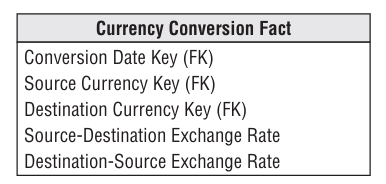


| date_key   | source | destination | src_to_dest | dest_to_src |
| ---------- | ------ | ----------- | ----------- | ----------- |
| 2024-01-01 | JPY    | USD         | 0.0091      | 110         |
| 2024-01-01 | EUR    | USD         | 1.08        | 0.9259      |
| 2024-01-01 | VND    | USD         | 0.000041    | 24390       |


### 8. Sự khó hòa hợp giữa bảng Order và Order Detail
**Chủ đề chính:** Khi thiết kế **data warehouse**, gặp tình huống có **dữ liệu ở nhiều mức chi tiết khác nhau** (granularity) trong cùng một giao dịch. Ví dụ, trong một đơn hàng:

* Có các thông tin **cấp header** (cấp tổng thể) như phí vận chuyển cho cả đơn hàng.
* Có các thông tin **cấp line item** (cấp chi tiết) như số lượng, giá từng sản phẩm trong đơn.

---

**Giải pháp 1**: Phân bổ (allocation)

* Ý tưởng là **chia các giá trị ở cấp header xuống từng dòng sản phẩm**.
  * VD: phí vận chuyển là 10 đô cho cả đơn hàng có 2 sản phẩm, bạn có thể phân bổ mỗi sản phẩm 5 đô hoặc dựa trên trọng lượng, giá trị…
  * Khi làm vậy, bạn có thể **tổng hợp, phân tích theo bất kỳ chiều nào**, ví dụ theo sản phẩm, nhân viên bán hàng, khách hàng…

**Lưu ý:** Việc phân bổ thường cần sự đồng thuận từ các bộ phận như **tài chính** hoặc **logistics**, vì họ có thể có cách tính khác nhau. Nếu không thống nhất được, bạn có thể:

  * Tạo **2 phiên bản phân bổ** (ví dụ theo trọng lượng và theo giá trị).
  * Hoặc không phân bổ và chỉ lưu ở cấp tổng thể (cấp header), nhưng cách này sẽ **khó dùng để phân tích theo sản phẩm**.

---

**Giải pháp 2**: Tạo 2 fact ko flatten

## III. Invoice Transactions
Order là đơn đặt còn 

Invoice là hóa đơn (đơn đã giao)

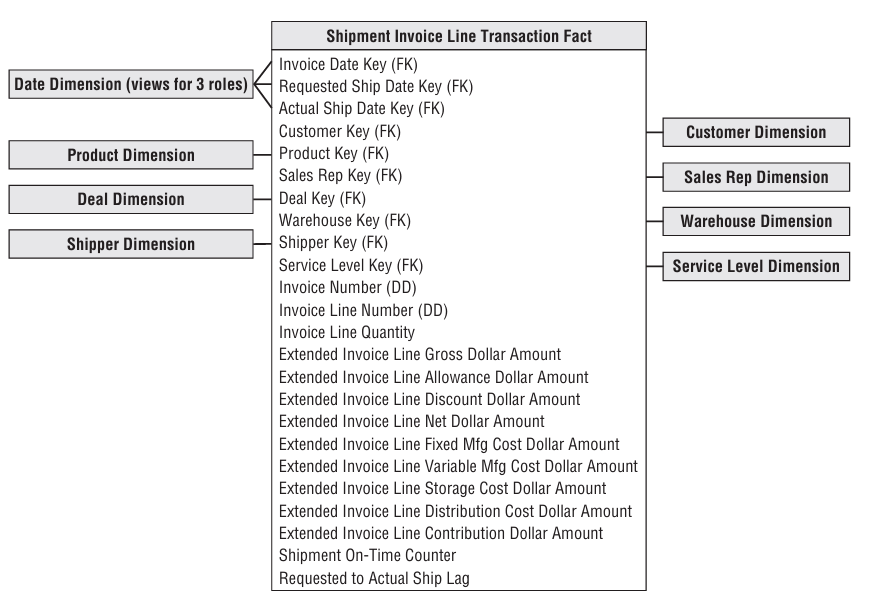


1. `Các measure trong Invoice Line`

| Tên cột                                                   | Ý nghĩa                                                              | Ví dụ                          |
| --------------------------------------------------------- | -------------------------------------------------------------------- | ------------------------------ |
| **Extended Invoice Line Gross Dollar Amount**             | Tổng tiền trước khi trừ chiết khấu, phụ phí                          | 1000 USD                       |
| **Extended Invoice Line Allowance Dollar Amount**         | Số tiền giảm giá đặc biệt (khuyến mãi, hỗ trợ khách)                 | 50 USD                         |
| **Extended Invoice Line Discount Dollar Amount**          | Số tiền giảm giá theo chương trình (ví dụ: 10% off)                  | 100 USD                        |
| **Extended Invoice Line Net Dollar Amount**               | Tiền cuối cùng khách phải trả (Gross - Allowance - Discount)         | 1000 - 50 - 100 = 850 USD      |
| **Extended Invoice Line Fixed Mfg Cost Dollar Amount**    | Chi phí sản xuất cố định cho sản phẩm (không thay đổi theo số lượng) | 300 USD                        |
| **Extended Invoice Line Variable Mfg Cost Dollar Amount** | Chi phí sản xuất biến đổi (tăng theo số lượng)                       | 50 USD                         |
| **Extended Invoice Line Storage Cost Dollar Amount**      | Chi phí lưu kho sản phẩm trước khi giao                              | 10 USD                         |
| **Extended Invoice Line Distribution Cost Dollar Amount** | Chi phí vận chuyển/phân phối                                         | 20 USD                         |
| **Extended Invoice Line Contribution Dollar Amount**      | Lợi nhuận đóng góp: Net Revenue - (Tất cả chi phí)                   | 850 - (300+50+10+20) = 470 USD |


2. `Service Level Dimension`

| Service Level Key | Name      | Description           | SLA Days |
| ----------------- | --------- | --------------------- | -------- |
| 1                 | Standard  | Giao hàng bình thường | 5 ngày   |
| 2                 | Expedited | Giao hàng nhanh       | 2 ngày   |
| 3                 | Overnight | Giao hàng qua đêm     | 1 ngày   |

---

### 1. Service Level Performance as Facts, Dimensions, or Both
Khi một dòng invoice được tạo ra, hệ thống đã biết hết các loai ngày tháng

Nhưng **vấn đề** là:
- business không muốn nhìn ngày rồi tự so sánh trong đầu kiểu "à cái này trễ 2 ngày". 
- Họ muốn hệ thống nói thẳng cho họ biết kết quả.

Làm giàu metrics:
- on_time_flag: yes/no
- lag_days: 1, 0, -2 (âm là giao trễ)

Làm giàu bằng junk dim

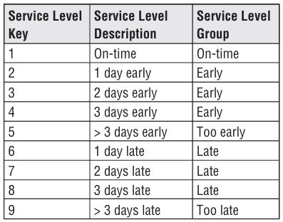


---

### 2. Profit and Loss Facts
Thiết kế ở fact nếu có thể hãy thêm các chỉ số
- `Gross` amount (price * quantity)
- `Allowance` (Khoảng giảm giá ngoài deal được)
- `Discount` (Khoảng giảm giá niêm yết)
- `Net` amount - (gross – allowance – discount) ta được **Contribution**/**Margin**
  - Mặc dù đây ko phải là chi phí thực vì chưa tính kho bãi, ship,.. nhưng cũng đủ cho cái nhìn chi tiết

Sau khi lấy:

> net amount – tất cả chi phí

Ta được **contribution**.

Contribution **không phải lợi nhuận cuối cùng của công ty**, vì:

* chưa trừ chi phí hành chính
* chưa trừ chi phí quản lý chung

Nhưng nó **cực kỳ quan trọng**, vì:

* cho biết **sản phẩm nào có lời**
* khách hàng nào “nuôi” công ty
* deal nào tưởng bán nhiều mà thực ra lỗ

Nhiều công ty gọi contribution là **margin**.

## IV. Accummulating Snapshot for Order Fullfillment Pipeline
* Có:
  * Lag
  * Multi Units (Lưu số đo ko lưu kết quả => ko bị mất lịch sử mặc dù ko dùng SCD type 2)

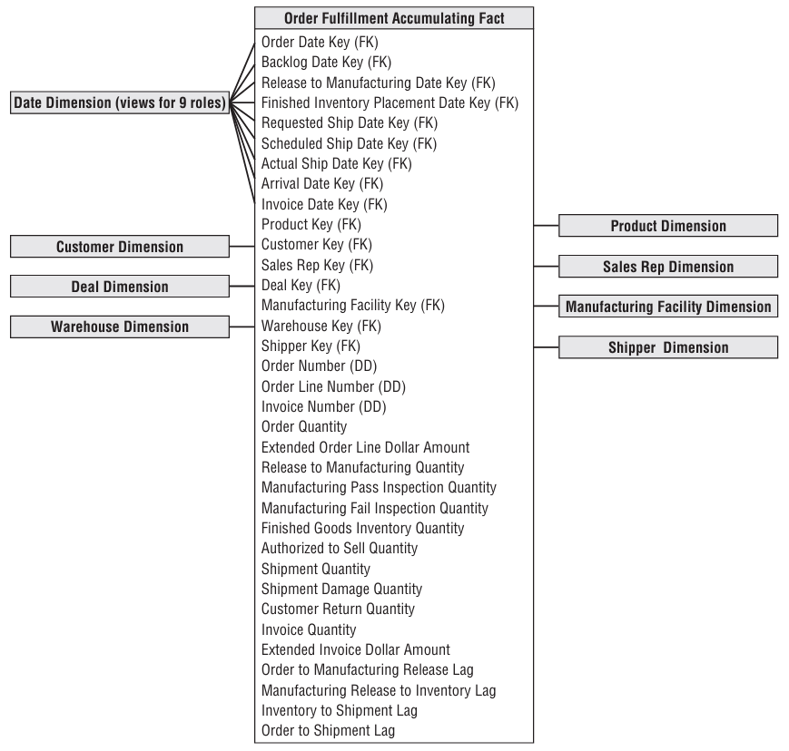


---


`Table fact`: fact_order_fulfillment

order_id | product_id | order_qty_ship_case | retail_case_factor | scan_unit_factor
---------|------------|---------------------|--------------------|------------------------------
1001     | COKE330    | 10                  | 12                 | 72
1002     | COKE330    | 5                   | 12                 | 72

<br>

---
<br>

`View team marketing/sales`: vw_sales_quantity

order_id | product | order_qty_retail_case | order_qty_scan_unit
---------|---------|-----------------------|--------------------------------------
1001     | Coke    | 120                   | 720
1002     | Coke    | 60                    | 360

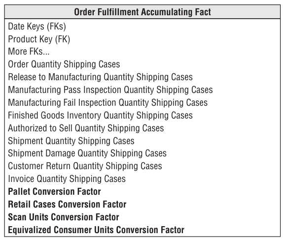